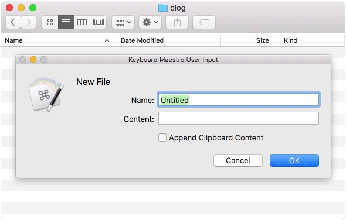

It's possible to create new *folders* in Finder.app, but creating *files* are not supported. I've created a <a href="https://www.keyboardmaestro.com/">Keyboard Maestro</a> macro that lets you spawn new files at will:

If you're not familiar with <a href="https://www.keyboardmaestro.com/">Keyboard Maestro</a> it's a tool similar to <a href="https://www.raywenderlich.com/58986/automator-for-mac-tutorial-and-examples">Automator</a>, that allows you to create macros that can be triggered in a number of ways e.g. when a hot key is pressed. In this case I've mapped the "New File…" macro to ⌘⌥N.

Download the macro: <a href="../files/New-File.kmlibrary">New-File.kmlibrary</a> 
