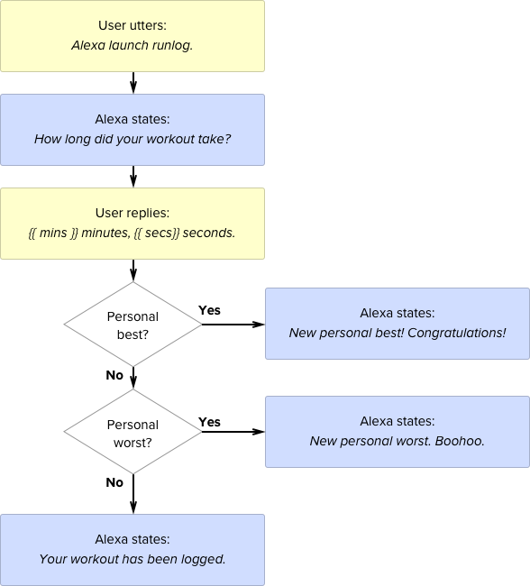
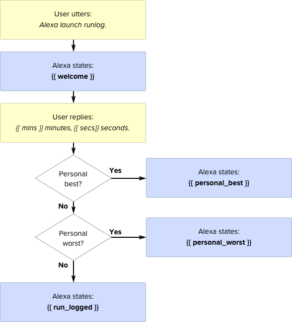

**TLDR:** Learn a bit of Python and you can create a custom skill with [Flask-ask](https://flask-ask.readthedocs.io) in a breeze.

They yell down on us from their high horses: [*Designers shouldn’t code*](https://medium.com/re-write/we-dont-need-more-designers-who-can-code-b81483d2a0e6#.qeq1ofxyl). Designers should pound the drum and developers should dance to the beat. Well, I've been dancing a secret proverbial tango with Python lately.

This is my first step outside of the Python Hello World sandbox. I recently came upon an [Amazon Echo](https://www.amazon.com/Amazon-Echo-Bluetooth-Speaker-with-WiFi-Alexa/dp/B00X4WHP5E) and I was curious to see if I could create my own skill. As much as I enjoy receiving flash briefings from NPR, I wanted to do more. I wanted Alexa to keep track of my daily run:

<iframe width="640" height="360" src="https://www.youtube.com/embed/wwz_7o7_W_k" frameborder="0" allowfullscreen></iframe>

John Wheeler’s [Flask-Ask](https://flask-ask.readthedocs.io) framework makes it easy to create Alexa  Skills. If you’re interested in creating your own skills I would  highly recommend that you pony up the $15 and buy his [Alexa tutorial videos](https://alexatutorial.com/). It’s an absolute bargain.

### Creating the VUI flow

VUI is an acronym I learned last week, it stands for Verbal User Interface. Here's the VUI flowchart for the Run Log skill:

This is a simplistic VUI, but it will suffice for our proof-of-concept purposes.

### Setting up the development environment

Follow John's tutorial to get up and running with Flask-Ask:

<iframe width="640" height="360" src="https://www.youtube.com/embed/cXL8FDUag-s" frameborder="0" allowfullscreen></iframe>

My <code><a href="https://github.com/timkl/alexa-runlog/blob/master/speech_assets/IntentSchema.json">IntentSchema</a></code> and <code><a href="https://github.com/timkl/alexa-runlog/blob/master/speech_assets/SampleUtterances.txt">SampleUtterances</a></code> are very simple for this proof-of-concept skill. I use Amazon's own <code><a href="https://developer.amazon.com/public/solutions/alexa/alexa-skills-kit/docs/alexa-skills-kit-interaction-model-reference#Slot Types">AMAZON.DURATION</a></code> slot type that makes it possible for the user to utter a workout duration and easy for us to parse that duration:

<pre><code>{
  "intents": [
    {
      "intent": "DurationIntent",
      "slots": [
        {
          "name": "duration",
          "type": "AMAZON.DURATION"
        }
      ]
    }
  ]
}
</code></pre>

### Response template

Let me a reveal a secret here: Alexa is *not* a personal assistant. Alexa is a voice terminal robot and we have to stand on the edge of the scene and feed her lines to create the illusion of dialogue. These lines live in the [Jinja](http://jinja.pocoo.org/) template:

<pre><code>welcome: "How long did your workout take?"

welcome_reprompt: "I did not catch that. How many minutes did your workout take?"

run_logged: "OK, I have logged {{ minutes }} minutes, {{ seconds }} seconds."

personal_best: "{{ minutes }} minutes, {{ seconds }} seconds. That is a new personal best. Congratulations tiger!"

personal_worst: "{{ minutes }} minutes, {{ seconds }} seconds. That is a new personal worst. Please up your game."
</code></pre>

This is how the responses map to our VUI flowchart:

### Adding some audio flavor

Plain text strings can get you a long way, but for more advanced speech features [SSML](https://developer.amazon.com/public/solutions/alexa/alexa-skills-kit/docs/speech-synthesis-markup-language-ssml-reference) is required. SSML is a markup language that is tailored to the creation of synthetic speech, it provides some impressive features like phonemic pronunciation. Very handy if you want to mention Arsenal's goal-keeper [Wojciech Szczęsny](https://www.youtube.com/watch?v=emf3G2OrjCw) in your skill.

I used the <code>audio</code> tag in my skill, to play a sad trombone when you log a personal worst and an upbeat sax riff if you log a personal best:

<pre><code>personal_best: &lt;speak>&lt;audio src="https://s3-us-west-1.amazonaws.com/run-log/best.mp3" /&gt;{{ minutes }} minutes, {{ seconds }} seconds. That is a new personal best. Congratulations tiger!&lt;/speak&gt;

personal_worst: &lt;speak&gt;&lt;audio src="https://s3-us-west-1.amazonaws.com/run-log/worst.mp3" /&gt;{{ minutes }} minutes, {{ seconds }} seconds. That is a new personal worst. Please up your game.&lt;/speak&gt;
</code></pre>

This proved more difficult than expected, Alexa doesn't take any old mp3. I had to encode the mp3 in [ffmpeg](https://ffmpeg.org/) using these parameters:  

<code><pre>ffmpeg -i input.mp3 -b:a 48k -ar 16000 output.mp3</pre></code>

### Skill logic

The logic lives in the <code><a href="https://github.com/timkl/alexa-runlog/blob/master/alexa-runlog.py">alexa-runlog.py</a></code> script. The <code><a href="http://flask-ask.readthedocs.io/en/latest/requests.html#mapping-alexa-requests-to-view-functions">launch</a></code> decorator determines what Alexa should do when the skill is launched:

<code><pre>@ask.launch
def launch():
    welcome_msg = render_template('welcome')
    return question(welcome_msg)</pre></code>

The <code><a href="http://flask-ask.readthedocs.io/en/latest/requests.html#mapping-alexa-requests-to-view-functions">intent</a></code> decorator determines what happens after the user has replied with the run duration:

<code><pre>
@ask.intent("DurationIntent", convert={'duration': 'timedelta'})
	'''
	Parsing and writing the duration to a CSV file…
	'''
	if(personal_best > duration):
		return statement(personal_best_msg)
	if(personal_worst < duration):
		return statement(personal_worst_msg)
	else:
		return statement(logged_msg)
</pre></code>

### Next steps

This is a crude prototype. There's many tasks to complete before  the skill is ready for public consumption:

* Host the skill on S3.
* Authenticate the user with Amazon.
* Store the run data in an actual database.
* Show information in the Alexa app.
* Improve the voice design as per [Amazon's guidelines](../files/alexa-webinar-presentation-v01.pdf).
* Make it possible to ask for personal best and worst.
* Create a simple website that displays Run Log data.

All to come in *Running with Alexa Pt. 2*.
